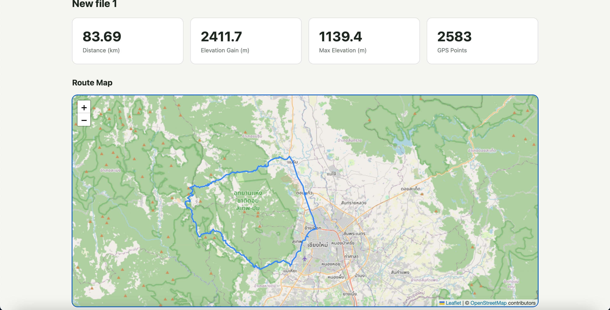
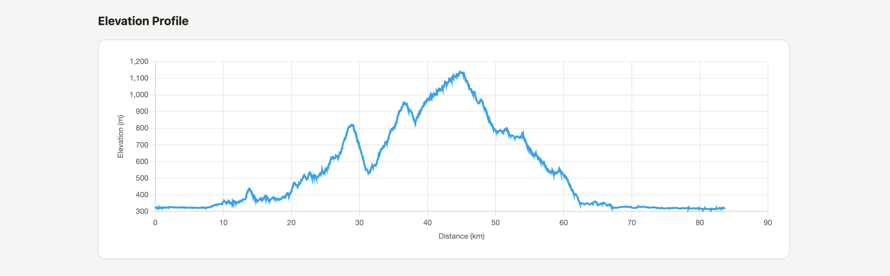

# RouteLens

**RouteLens** is a full-stack geospatial application that analyzes GPX route files and transforms raw GPS track data into interactive route maps, elevation profiles, and route statistics.

Users can upload a `.gpx` file and immediately inspect route distance, elevation gain, maximum elevation, GPS point count, route geometry, and elevation changes along the route.

## Features

- Upload and analyze GPX route files
- Calculate total route distance
- Calculate elevation gain and loss
- Identify minimum and maximum elevation
- Calculate route duration and average speed when timestamps are available
- Convert GPX track segments into GeoJSON
- Preserve disconnected GPX track segments
- Display routes on an interactive Leaflet map
- Automatically zoom the map to the uploaded route
- Generate an elevation profile using real route distance
- Handle GPX files containing thousands of GPS points
- Validate unsupported or malformed uploads

## Demo

## Demo

**Live application:** https://routelens-six.vercel.app 
**API documentation:** https://routelens-api.onrender.com/docs

## Screenshots

### Route Analysis



### Elevation Profile



## Tech Stack

### Frontend

- TypeScript
- Vite
- Leaflet
- Chart.js
- HTML / CSS

### Backend

- Python
- FastAPI
- gpxpy
- Pydantic
- Uvicorn

### Geospatial Formats

- GPX
- GeoJSON

## Architecture

```text
GPX File
   │
   ▼
TypeScript Frontend
   │
   │ multipart/form-data
   ▼
FastAPI
   │
   ▼
gpxpy Parser
   │
   ├── Track / Segment Extraction
   ├── Distance Calculation
   ├── Elevation Analysis
   ├── Timestamp Analysis
   └── GeoJSON Conversion
   │
   ▼
JSON API Response
   │
   ├───────────────┐
   ▼               ▼
Leaflet         Chart.js
Route Map       Elevation Profile